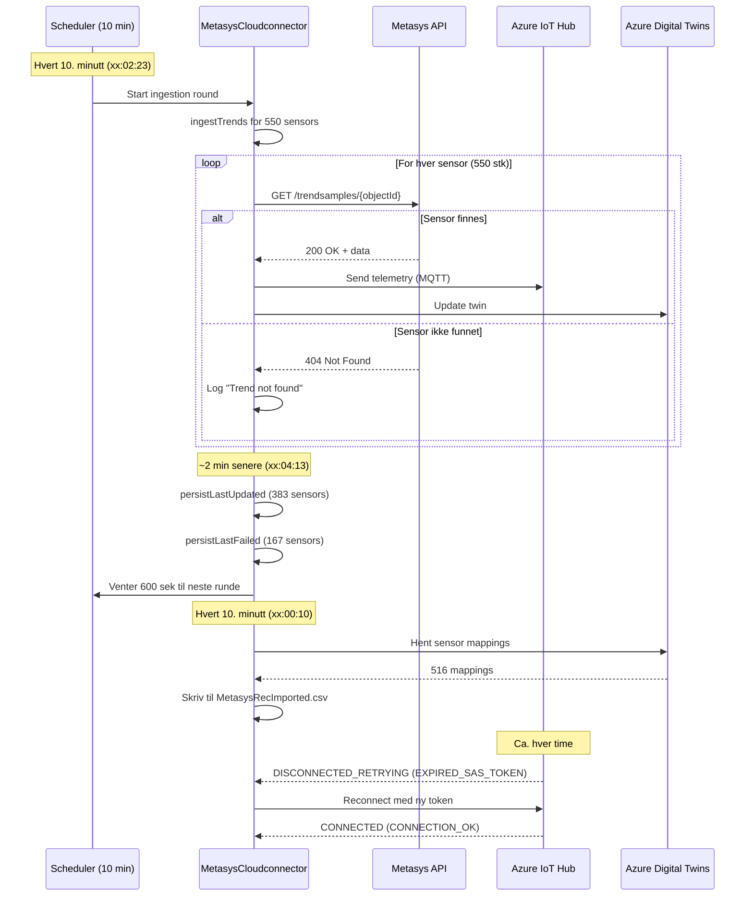
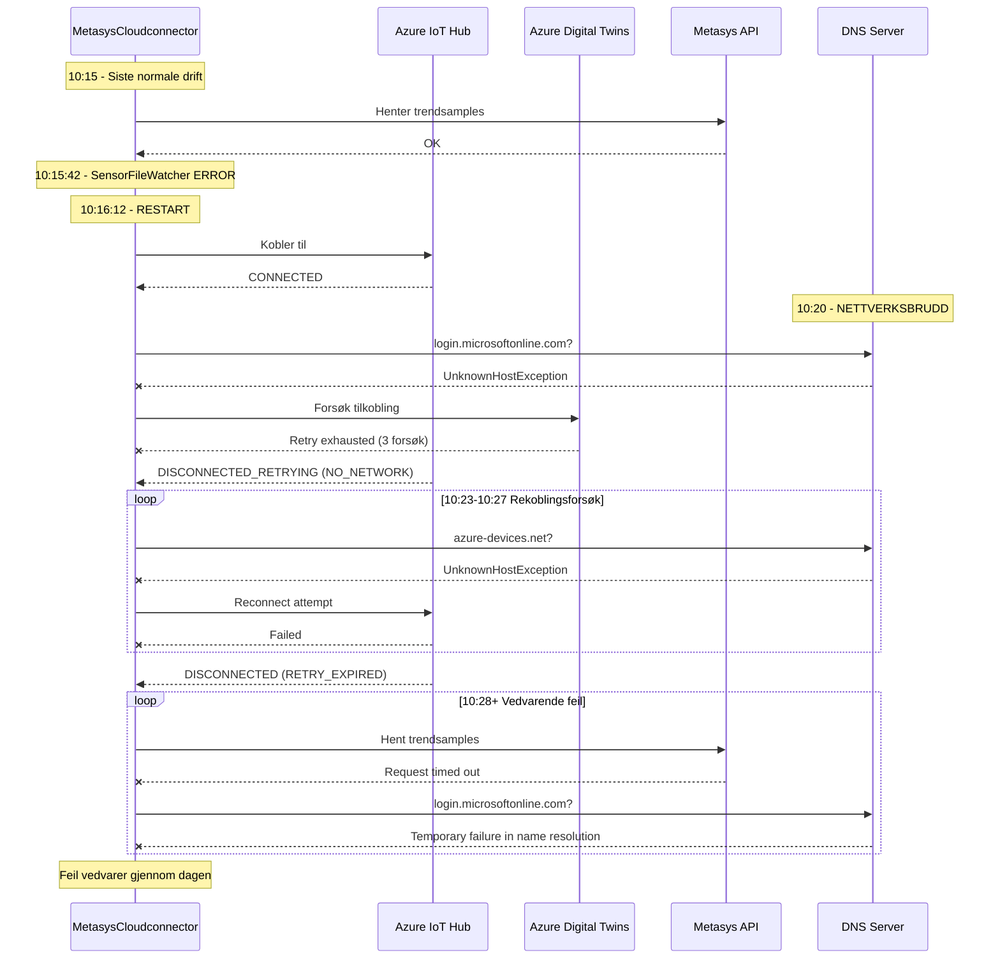

# Nettverksbrudd 15. januar 2026 - Metasys Cloudconnector

## Oversikt

Nettverksproblemer påvirket tjenesten gjennom hele dagen 15. januar 2026, med DNS-oppslag som feilet mot Azure-tjenester og timeouts mot Metasys API.

---

## Normal oppførsel (før nettverksbruddet)

### Periodiske prosesser

| Prosess | Intervall | Beskrivelse |
|---------|-----------|-------------|
| **Health updater** | ~2 sek | Sjekker MetasysStreamClient token status |
| **RecCsvCreatorAzureDigitalTwin** | 10 min | Eksporterer 516 sensor mappings til CSV |
| **ScheduledObservationMessageRouter** | 10 min | Starter ingestion-runde for tjenester |
| **MetasysTrendsIngestionService** | 10 min | Henter trendsamples for 550 sensorer |
| **InMemoryTrendsLastUpdatedService** | 10 min | Persisterer status (383 OK, 167 feilet) |
| **IoT Hub SAS Token** | ~1 time | MQTT token fornyelse |
| **Metasys token refresh** | Ved behov | Full login ved 401 |

### Sekvensdiagram - Normal drift



### Normal loggflyt (eksempel fra 09:00-09:05)

```
09:00:00  [health-updater-1]  MetasysStreamClient.isLoggedIn - UserToken expired check
09:00:10  [main]              RecCsvCreatorAzureDigitalTwin - Writing 516 mappings to CSV
09:02:23  [pool-15-thread-1]  ScheduledObservationMessageRouter - Request ingestion round
09:02:23  [pool-15-thread-1]  MetasysTrendsIngestionService - Running ingestTrends for 550 sensors
09:02:23  [pool-15-thread-1]  MetasysClient - Failed to fetch (404) for objectId: xxx
09:02:23  [pool-15-thread-1]  MetasysTrendsIngestionService - Trend not found for TrendId xxx
          ... (gjentas for hver sensor) ...
09:04:13  [pool-15-thread-1]  InMemoryTrendsLastUpdatedService - persisting 383 updated
09:04:13  [pool-15-thread-1]  InMemoryTrendsLastUpdatedService - persisting 167 failed
09:04:13  [pool-15-thread-1]  ScheduledObservationMessageRouter - Waiting 600 seconds
```

### Nøkkeltall - Normal drift

- **Sensorer totalt**: 550
- **Sensorer med data**: 383 (~70%)
- **Sensorer uten data (404)**: 167 (~30%)
- **Sensor mappings fra ADT**: 516
- **Ingestion-syklus**: ~2 minutter (09:02:23 → 09:04:13)
- **Ventetid mellom sykluser**: 600 sekunder (10 min)

---

## Tidslinje - Nettverksbrudd

| Tid | Hendelse |
|-----|----------|
| 00:00-10:15 | Normal drift - Periodiske SAS token fornyelser (~1t intervaller) |
| 10:15:42 | ERROR i SensorFileWatcher |
| 10:16:12 | Applikasjonen restartet |
| 10:17:12 | Server startet på nytt, HTTP på port 8081 |
| 10:20:21 | **Nettverksbrudd oppdaget** - `UnknownHostException: login.microsoftonline.com` |
| 10:21:34 | Azure Digital Twins retry exhausted |
| 10:22:50 | IoT Hub transport → `DISCONNECTED_RETRYING` (grunn: `NO_NETWORK`) |
| 10:23:42 | Rekoblingsforsøk feiler - `UnknownHostException: cludconnectorhub-test-west.azure-devices.net` |
| 10:27:00 | IoT Hub → `DISCONNECTED` (grunn: `RETRY_EXPIRED`) |
| 10:28+ | Gjentatte timeouts til Metasys API + DNS-feil til Azure |

## Påvirkede tjenester

- **Azure IoT Hub** (MQTT) - Mistet forbindelse, ga opp reconnect etter ~4 min
- **Azure Digital Twins** - Kunne ikke hente/oppdatere twins
- **Azure AD login** - Token refresh feilet
- **Metasys API** - Request timeouts

## Sekvensdiagram - Nettverksbrudd



## Feilmeldinger

### DNS-feil
```
java.net.UnknownHostException: login.microsoftonline.com: Name or service not known
java.net.UnknownHostException: login.microsoftonline.com: Temporary failure in name resolution
java.net.UnknownHostException: cludconnectorhub-test-west.azure-devices.net
```

### IoT Hub
```
DISCONNECTED_RETRYING with reason NO_NETWORK
DISCONNECTED with reason RETRY_EXPIRED
Device operation for reconnection timed out
```

### Metasys API
```
java.net.http.HttpTimeoutException: request timed out
Failed to fetch trendsamples for objectId: ... Reason: request timed out
```

## Analyse

1. **Rotårsak**: DNS-oppslag feilet, noe som indikerer tap av internettforbindelse eller DNS-server problemer
2. **IoT Hub oppførsel**: SDK ga opp reconnect etter ca. 4 minutter med mislykkede forsøk (RETRY_EXPIRED)
3. **Ingen automatisk recovery**: Etter at IoT Hub gikk til DISCONNECTED, ble det ikke gjort flere reconnect-forsøk
